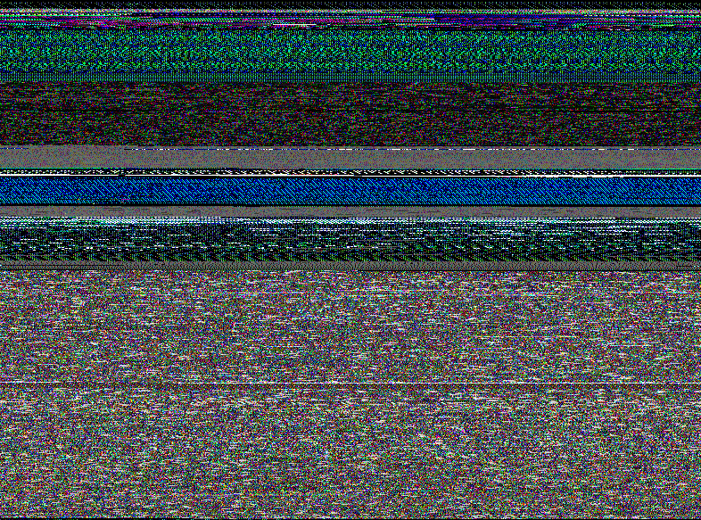

# BIN-BMP

A utility to convert any binary file into a BMP file, align on the 4th byte,
and look for patterns.   Useful for looking into new and uncharted binaries and
doing protocol inspection.


```bash
$ ./bin-bmp -h
bmp-bin,  Version: 0.1.20220527.1328 (https://github.com/pschou/bmp-bin)
A utility to convert a bin to a bmp to look for patterns, alignment is done on every
  4th byte, so 4 bytes -> 1 pixel.
NOTE: Only the first 3 bytes in a quad are used for RGB display, the 4th is omitted.

Usage: bin-bmp [options] input.bin output.bmp

  -c    Compression test
  -d    Decode, reverse the translation, bmp to bin
  -v    Verbose
  -w string
        Image width for output BMP
        auto - gives a 3/4 proportion image
        ### - specify the exact with for uniformity (default "auto")
```

## Example
Running bin-bmp on binaries will produce output like this:

```bash
$ ./bin-bmp bin-bmp bin-bmp.bmp
```

Example output of a GoLang binary:



```bash
$ upx --ultra-brute bin-bmp-upx
$ ./bin-bmp bin-bmp-upx bin-bmp-upx.bmp
```

Example output of a GoLang binary compressed with upx:


```bash
$ ./bin-bmp /usr/bin/ssh ssh.bmp
```

Example output of a C binary:


```bash
$ ./bin-bmp mindbright/ssh/SSHClient.java java.bmp
```

Example output of a Java binary:


